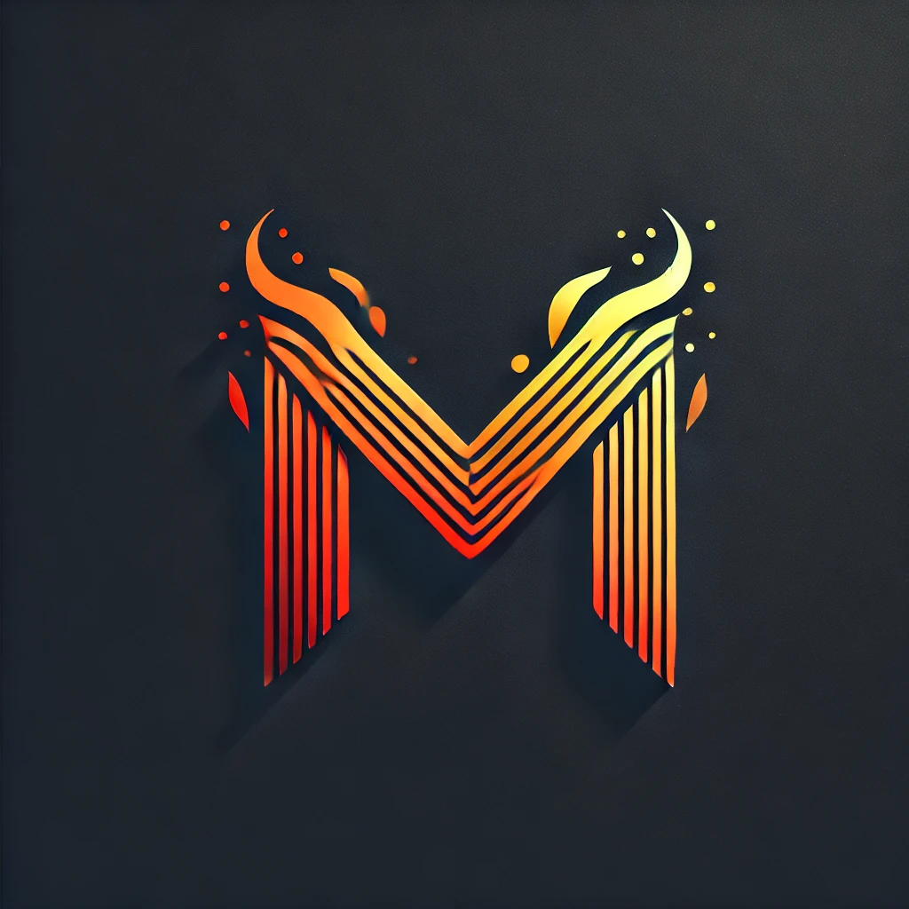

# Magma

**Magma** is a multiparadigm programming language that merges the features of Rust and TypeScript, designed primarily for high-performance front-end computing but also suitable for general use.

## Features

- **Multiparadigm**: Combines the best of Rust and TypeScript.
- **High Performance**: Optimized for front-end development.
- **General Use**: Versatile enough for various programming needs.

## Motivation

Magma was created to address the lack of easy-to-work-with languages focused on high-speed computing for front-end development. While AssemblyScript exists, it lacks the flexibility of TypeScript. Writing front-ends into WebAssembly in C++ or Rust can be extremely challenging and difficult to maintain, as neither language is built for the front-end.

## Design Principles

- **Speed and Safety**: Emphasizes performance and safety, similar to Rust.
- **Flexibility**: Offers flexibility with features like duck typing and type manipulation, akin to TypeScript.

## Installation

Magma is currently under construction. Installation instructions and dependencies will be provided once the language is ready for public use.

## Sample

```magma
import magma.api.Tuple;
import magma.api.option.Option;
import magma.api.result.Ok;
import magma.api.result.Result;
export class def HeadedStream<T>(provider : Head<T>) => {
	public def foldLeftToResult<R, E>(initial : R, mapper : (R, T) => Result<R, E>) => this.foldLeft(Ok.from(initial), () => reResult.flatMapValue(() => mapper.apply(inner, t)));
	public def anyMatch(predicate : (T) => Bool) => foldLeft(false, () => aBoolean||predicate.test(t));
	public def filter(filter : (T) => Bool) => flatMap(() => HeadedStream(filter.test(value) ? SingleHead(value) : EmptyHead.EmptyHead()));
	public def flatMap<R>(mapper : (T) => Head<R>) => HeadedStream(head().map(mapper).map(() => FlatMapHead(initial, this, mapper)).orElse(EmptyHead.EmptyHead()));
	public def extend<R>(mapper : (T) => R) => map(() => Tuple(value, mapper.apply(value)));
	public def map<R>(mapper : (T) => R) => HeadedStream(() => this.provider.head().map(mapper));
	public def collect<C>(collector : Collector<T, C>) => {
		let mut current = collector.createInitial();
		return foldLeft(current, collector.fold);
	}
	public def foldLeft<C>(current : C, folder : (C, T) => C) => while(true){
		let mut finalCurrent = current;
		let mut tuple = head().map(() => folder.apply(finalCurrent, head)).toTuple(current);
		if(tuple.left())
		{
			current = tuple.right();
		}
		else
		{
			return current;
		}
	}
	public def head() => provider.head();
	implements Stream<T>;
}
```

## Documentation

Documentation and tutorials are not yet available but will be provided as the language development progresses.

## Target Audience

Magma is designed for front-end developers seeking high performance and versatile programming capabilities.

## Contributions

We welcome feedback and contributions focused on viability at this stage. Please use GitHub issues to report bugs or suggest features.

## Community

Join our community on [Discord](https://discord.gg/7AFZMKFb) for discussions and updates.

## Integration and Interoperability

Magma is designed to interoperate with Rust and TypeScript to some degree. Magma compiles down to LLVM and JS, allowing interaction with any languages that work with these technologies.

## Future Plans

Future plans for Magma include the development of an integrated editor and continued enhancements to language features and performance. Long-term goals are still being defined.
