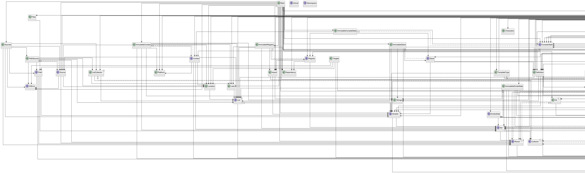

# Compiler Architecture

The compiler is structured as a set of stages. Source files are first lexed and parsed into an abstract syntax tree (AST). After parsing, the AST is transformed and emitted for each `TargetPlatform`.

```
Sources → Lexer → Parser → StagedCompiler → Generator → Output
```

The `StagedCompiler` combines a `Parser` with a `Generator`. A platform implementation (for example `PlantUMLTargetPlatform` or `TypeScriptTargetPlatform`) provides the specific parser rules and a generator that knows how to convert the AST into the desired output format.

The `CompileApplication` ties everything together. It loads the source units, runs the configured compiler and writes the results to the target directory.

The relationships between the main classes are illustrated in `diagram.png` in this folder:


